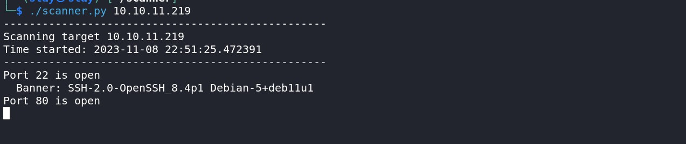

# Vulnerability Scanner 🔍

A lightweight and efficient scanning tool designed for cybersecurity professionals and enthusiasts. This project helps detect vulnerabilities, misconfigurations, and security loopholes in web applications and networks.

# 🚀 Features

* Fast and accurate scanning
* Supports multiple scan types (e.g., ports, subdomains, vulnerabilities)
* User-friendly CLI interface
* Logs and reports for analysis
* Customizable scan configurations

# 🛠 Installation

  ```
  git clone https://github.com/asterisk51/scanner.git  
  cd scanner
  ```
# 🔍 Usage

Run a basic scan:

  ```
  python scanner.py --target example.com
  ```




